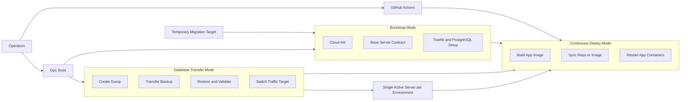
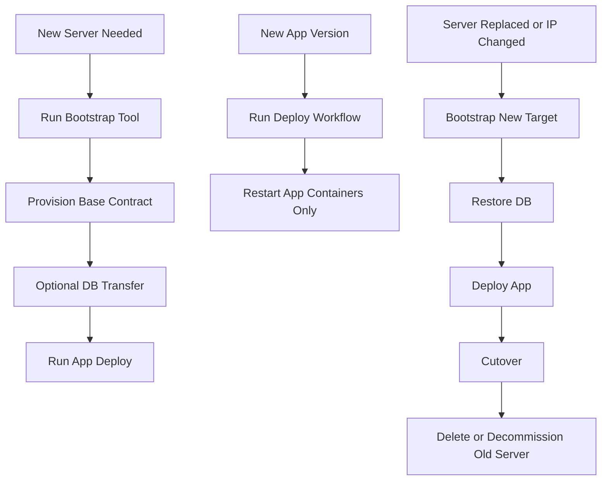

# Deployment Operating Model

Diese Spezifikation definiert das künftige Betriebsmodell für Skuld-Deployments.

Ziel ist ein einheitlicher Ablauf für zwei Hauptfälle:

1. Ein vorhandener Server soll regulär weiterbetrieben und mit neuer App-Version versorgt werden.
2. Ein neuer oder ersetzter Server soll standardisiert aufgesetzt, mit Daten versorgt und ohne Sonderlogik als Zielsystem nutzbar werden.

Die Spezifikation priorisiert operative Klarheit vor technischer Vollausbaustufe.

## Zielbild

Skuld soll mit einem einzigen Betriebsmodell arbeiten:

- pro Environment existiert genau ein aktiver Server
- ein zweiter Server existiert nur temporär während einer Migration oder eines Ersatzes
- jeder Server folgt demselben Server-Contract
- jede Umgebung folgt demselben Secret- und Workflow-Schema
- Datenbank-Lifecycle ist ein expliziter Betriebsmodus, nicht versteckte Nebenwirkung
- App-Deployment ist von Infrastruktur-Bootstrap getrennt
- Monitoring ist vorerst nicht Teil des Standard-Deployments
- Tailscale-only SSH ist mittelfristiges Ziel, aber nicht Teil der ersten Vereinheitlichung

## Scope

### In Scope

- Server-Bootstrap für neue Zielsysteme
- App-Deployment für bestehende Zielsysteme
- Datenbank-Migration bzw. Serverwechsel mit Restore/Cutover
- GitHub-basierte Auslösung und Umgebungssteuerung
- einheitliche Benutzer, Pfade, Netzwerke und Secrets
- einfache Operations-Tools für Provisionierung und DB-Transfer

### Out of Scope For Now

- Monitoring-Deployment
- zentrale Log-Aggregation
- Tailscale-only Zugriff als Pflicht
- Streaming-Replikation für PostgreSQL
- Kamal-Einführung

Diese Punkte dürfen später ergänzt werden, sollen aber die erste Vereinheitlichung nicht blockieren.

## Operating Model Diagram

Kernregel:
Es gibt im Normalbetrieb keinen dauerhaften Parallelbetrieb mehrerer Hetzner-Server pro Environment.
Wenn ein neuer Server entsteht, ist er zunächst nur ein temporäres Migrationsziel.

## Standard Server Contract

Jeder Skuld-Server muss vor einem Deployment diese Eigenschaften besitzen:

| Bereich | Standard |
|---|---|
| User für CI/CD | `deploy` |
| SSH | Key-only |
| Sudo | `NOPASSWD:ALL` |
| Docker | installiert |
| Docker-Netzwerke | `web`, `postgres_setup_default` |
| App-Pfad | `/opt/skuld` |
| DB-Pfad | `/opt/postgres_setup` |
| Logs | `/opt/skuld/logs` |
| Backups | `~/backups/postgres` |
| Secret-Schema | GitHub Environment Secrets und Variables |

Optional darf es zusätzliche Admin-User geben, aber Deployments laufen ausschließlich über `deploy`.

## Betriebsmodi

### 1. Mode: Initial Server Bootstrap

Zweck:
Ein neuer Server wird auf einen standardisierten Grundzustand gebracht.

Input:

- Zielname und Ziel-IP
- Cloud-Init Template
- gewünschte Rollen: App, DB, Reverse Proxy
- GitHub Environment-Zuordnung

Output:

- Server ist per `deploy` erreichbar
- Docker ist installiert
- Standard-Netzwerke existieren
- Zielpfade existieren
- Traefik und PostgreSQL können optional direkt mit eingerichtet werden
- Zielsystem ist deployment-ready

Pflichtregel:
Der Bootstrap baut nur Basis-Infrastruktur. Er deployt nicht implizit die App.

### 2. Mode: Continuous Application Deployment

Zweck:
Eine neue App-Version wird auf einen bereits vorbereiteten Server ausgerollt.

Input:

- Zielumgebung, z. B. `prod` oder `dev-hetzner`
- Git-Ref oder Branch
- GitHub Environment mit zugehörigen Secrets und Variables

Output:

- App-Code wird auf dem Zielsystem aktualisiert
- App-Container werden neu gebaut bzw. neu gestartet
- Deployment ist validierbar über Healthchecks und Containerstatus

Pflichtregel:
Dieser Modus verändert weder PostgreSQL-Volumes noch Traefik-Basisstruktur.

### 3. Mode: Server Replacement or Relocation

Zweck:
Ein alter Server wird durch einen neuen ersetzt oder ein Dienst zieht auf eine neue IP um.

Ablauf:

1. neuen Server bootstrappen
2. Infrastruktur auf Zielserver vorbereiten
3. DB von Quelle nach Ziel transferieren
4. App auf Zielserver deployen
5. Validierung durchführen
6. DNS oder Workflow-Target umschalten
7. alten Server stilllegen oder löschen

Pflichtregel:
Der neue Server wird erst nach erfolgreicher DB- und App-Validierung zum aktiven Ziel.

### 4. Mode: Database Transfer

Zweck:
Datenbank-Inhalte von Server A nach Server B übertragen.

Kurzfristiger Standard:

- Dump
- Transfer
- Restore
- Validierung

Nicht Teil der ersten Version:

- Streaming-Replikation
- permanenter Primary/Replica-Betrieb
- dauerhaft mehrere aktive Hetzner-Server für dasselbe Environment

Begründung:
Dump/Restore ist für euren aktuellen Reifegrad wesentlich einfacher, transparenter und ausreichend für Serverwechsel.

## Active Target Model

Für jedes Environment gilt genau ein aktives Ziel.

Beispiele:

- `production` zeigt auf genau einen aktiven Server
- `dev-hetzner` zeigt auf genau einen aktiven Server

Während einer Migration darf zusätzlich ein temporäres Ziel existieren. Dieses Ziel wird aber erst nach Restore, Deploy und Validierung aktiv geschaltet.

Das bedeutet ausdrücklich:

- kein permanentes Active-Active-Modell
- kein dauerhafter Betrieb von Helsinki und Falkenstein als gleichwertige Produktionsziele
- keine komplexe Multi-Node-Orchestrierung in der ersten Ausbaustufe

## Container-Verhalten Beim Regeldeployment

Ein normales App-Deployment soll folgende Regeln einhalten:

| Komponente | Verhalten |
|---|---|
| `skuld-frontend` | neu bauen oder neues Image ziehen, dann neu starten |
| `skuld-backend` | neu bauen oder neues Image ziehen, dann neu starten |
| `authelia` | nur neu starten, wenn Konfiguration/Secrets geändert wurden; im einfacheren ersten Modell darf mit neugestartet werden |
| `postgres_setup-db-1` | nicht durch App-Deployment neu bauen oder löschen |
| `traefik` | nicht Teil des Standard-App-Deployments |

Konsequenz:
Ein regulärer App-Deploy arbeitet primär auf `/opt/skuld` und nicht auf `/opt/postgres_setup`.

## Trigger-Matrix

## GitHub Trigger Rules

Die Auslösung soll nach klaren Regeln erfolgen:

| Fall | Trigger | Ziel |
|---|---|---|
| regulärer Prod-Deploy | manuell freigegebener Deploy-Workflow | aktuell aktiver Prod-Server |
| regulärer Dev-Deploy | manueller `workflow_dispatch` | aktuell aktiver Dev-Server |
| Bootstrap | kein normaler App-Workflow, sondern Ops-Tool | neuer Server |
| DB-Transfer | Ops-Tool oder eigener Workflow | Quell- und Zielserver |
| Server-Cutover | expliziter Operator-Schritt | Zielsystem aktiv setzen |

Pflichtregel:
Bootstrap und DB-Transfer dürfen nicht implizit durch normalen Code-Push ausgelöst werden.

Zusatzregel:
Ein Push auf einen Branch darf nicht automatisch einen Serverwechsel oder DB-Transfer verursachen.

## GitHub Environments Model

GitHub bleibt vorerst die zentrale Steuerungsebene.

Jede Zielumgebung bekommt:

- einen klaren Environment-Namen
- identische Secret-Namen
- identische Variable-Namen
- unterschiedliche Werte pro Umgebung

Beispiel:

- `production`
- `dev-hetzner`

Jedes Environment beschreibt genau ein aktives Zielsystem, nicht eine Servergruppe.

## Monitoring Policy

Monitoring wird vorerst aus dem Standard-Deployment entfernt.

Regel:

- keine Kopplung des App-Deployments an Monitoring-Deployments
- Monitoring bleibt separierbar und optional
- bestehende Monitoring-Workflows können später in separatem Branch oder separatem Ops-Kontext weitergeführt werden

Ziel:
Die erste Vereinheitlichung soll nur das Kernsystem App plus DB plus Reverse Proxy betreffen.

## SSH and Access Policy

Kurzfristig:

- SSH über öffentliche IP ist erlaubt
- nur Key-only
- `deploy` ist Standardzugang für Automatisierung

Mittelfristig:

- Tailscale-only oder Tailnet-first Zugriff ist Zielbild
- dieser Schritt wird erst eingeführt, wenn das Basis-Deployment stabil läuft

Begründung:
Zugriffshärtung ist wichtig, aber nicht die erste Baustelle.

## Operations Tooling Specification

Es soll ein kleines, klares Ops-Toolset geben statt vieler Sonderfälle.

### Tool 1: `provision-server`

Zweck:
Neuen Server standardisiert anlegen.

Aufgaben:

- Cloud-Init anwenden
- SSH testen
- `deploy` User validieren
- Basisverzeichnisse anlegen
- optionale Rollen aktivieren: Traefik, PostgreSQL

### Tool 2: `migrate-db`

Zweck:
Datenbank von Server A nach Server B übertragen.

Aufgaben:

- Backup erzeugen
- Transfer validieren
- Restore durchführen
- Schema und Views validieren

### Tool 3: `cutover-target`

Zweck:
Aktives Zielsystem auf neuen Server umstellen.

Aufgaben:

- DNS oder GitHub Environment Host anpassen
- Connectivity prüfen
- Success/Failure sauber reporten
- alten Server für Stilllegung markieren

### Tool 4: `deploy-app`

Zweck:
App auf vorbereitetes Zielsystem deployen.

Aufgaben:

- `.env` generieren
- App syncen oder Image deployen
- Container neu starten
- Validierung ausführen

## Acceptance Criteria

Die Spezifikation gilt als erfüllt, wenn diese Szenarien ohne Sonderlogik möglich sind:

1. Neuer Dev-Server wird provisioniert und ist innerhalb eines definierten Ablaufs deployment-ready.
2. Ein App-Deploy auf bestehenden Dev- oder Prod-Server verändert nicht versehentlich die Datenbank-Infrastruktur.
3. Ein Serverwechsel von A nach B ist durch Bootstrap plus DB-Transfer plus Deploy plus Cutover möglich.
4. Jeder Server nutzt denselben `deploy` User und dieselben Pfade.
5. Monitoring ist nicht Voraussetzung für ein funktionierendes Kerndeployment.
6. Pro Environment ist im Normalbetrieb genau ein Server aktiv.

## Recommended Next Steps

1. Diese Spezifikation als verbindliche Zieldefinition akzeptieren.
2. Monitoring-Workflows aus dem Kernmodell herausziehen.
3. Cloud-Init und Provisioning-Script auf dieses Modell reduzieren.
4. Aus der Spezifikation konkrete Workflows und Ops-Skripte ableiten.
5. Erst danach prüfen, ob Kamal oder ein externer Secret-Manager einen echten Mehrwert bringt.