# Deployment and Secret Architecture

This document describes a pragmatic target architecture for Skuld deployment and secret handling with a strong bias toward operational simplicity.

The main decision is not "central secrets or GitHub secrets forever", but rather:

- use one standardized deployment contract on every server
- use one standardized secret naming scheme in every environment
- choose the smallest secret system that reduces operational chaos instead of adding more infrastructure too early

## Recommended Near-Term Architecture

```mermaid
flowchart LR
    Devs[Developers] --> GH[GitHub Repository]
    GH --> GHA[GitHub Actions]
    Admins[Operators] --> GHE[GitHub Environments]
    GHE --> GHA

    subgraph CONTRACT[Standard Server Contract]
        direction TB
        U[deploy user]
        P[/opt/skuld and /opt/postgres_setup]
        N[Docker networks: web and postgres_setup_default]
        B[Cloud-init bootstrap]
    end

    subgraph TARGETS[Deployment Targets]
        direction TB
        PROD[Helsinki Production]
        DEV[Falkenstein Development]
        STAGE[Staging or Home Server]
    end

    subgraph RUNTIME[Runtime Components]
        direction TB
        TRAEFIK[Traefik]
        APP[Skuld App Containers]
        AUTH[Authelia]
        DB[PostgreSQL]
        MON[Monitoring]
    end

    GHA --> CONTRACT
    CONTRACT --> PROD
    CONTRACT --> DEV
    CONTRACT --> STAGE

    PROD --> TRAEFIK
    PROD --> APP
    PROD --> AUTH
    PROD --> DB
    PROD --> MON

    DEV --> TRAEFIK
    DEV --> APP
    DEV --> AUTH
    DEV --> DB

    STAGE --> TRAEFIK
    STAGE --> APP
    STAGE --> AUTH
    STAGE --> DB

    FUTURE[Optional Future Secret Manager<br/>Infisical or Doppler] -. later migration .-> GHA
```

## Current Problem Landscape

This diagram shows why deployment currently feels harder than it should.

```mermaid
flowchart LR
    Devs[Developers] --> GH[GitHub Repository]
    GH --> GHA[GitHub Actions]

    subgraph PROD[Production: Helsinki]
        direction TB
        PUSER[deploy user<br/>password sudo legacy]
        PAPP[/opt/skuld]
        PDB[/opt/postgres_setup]
        PTRAEFIK[Traefik and Authelia]
    end

    subgraph DEV[Development: Falkenstein]
        direction TB
        DUSER[deploy and holu users<br/>cloud-init variant]
        DAPP[/opt/skuld]
        DDB[/opt/postgres_setup]
        DTRAEFIK[Traefik setup in progress]
    end

    subgraph CONTROL[Control Plane Today]
        direction TB
        ENV[GitHub Secrets and Environments]
        WF1[Production Workflow]
        WF2[Dev Workflow]
        SCRIPTS[Manual SSH and compose commands]
    end

    GHA --> WF1
    GHA --> WF2
    ENV --> WF1
    ENV --> WF2
    SCRIPTS --> PROD
    SCRIPTS --> DEV
    WF1 --> PROD
    WF2 --> DEV

    DRIFT[Operational Drift<br/>different users, different assumptions, partial manual steps]
    PROD --> DRIFT
    DEV --> DRIFT
    CONTROL --> DRIFT
```

The main issue is not a missing secret store. The main issue is drift between targets and workflows.

## Migration Path In Three Phases

This diagram shows the recommended order of change.

```mermaid
flowchart LR
    subgraph PHASE1[Phase 1: Stabilize]
        direction TB
        A1[Unify deploy user]
        A2[Unify paths and networks]
        A3[Use GitHub Environments]
        A4[Make workflows follow one schema]
    end

    subgraph PHASE2[Phase 2: Standardize Deployment]
        direction TB
        B1[Separate app, db, monitoring concerns]
        B2[Reduce SSH special cases]
        B3[Make deploy and rollback explicit]
        B4[Document server contract]
    end

    subgraph PHASE3[Phase 3: Optional Platform Upgrade]
        direction TB
        C1[Evaluate Kamal for app rollout]
        C2[Evaluate Infisical or Doppler]
        C3[Move secrets out of GitHub only if complexity justifies it]
        C4[Keep same names and contracts]
    end

    PHASE1 --> PHASE2 --> PHASE3
```



## Why GitHub Secret Management May Actually Be Better For Now

GitHub Environments are a stronger fit than they might look at first glance.

- they already sit directly in your deployment path
- they give you clean environment separation for `dev`, `prod`, and `staging`
- they reduce the number of moving parts while you are still fixing server consistency
- they are easier to reason about than introducing a new platform before the deployment process is stable

That means GitHub Environments are not just the easy option. For Skuld right now, they are likely the correct option.

The key condition is discipline:

- same secret names everywhere
- different values per environment
- no ad hoc server-local secrets unless explicitly required
- no workflow-specific naming drift

## Core Principle

Standardize names, roles, and process.
Do not standardize raw secret values across production and development.

Good standardization:

- same user name: `deploy`
- same directories: `/opt/skuld`, `/opt/postgres_setup`
- same workflow shape
- same secret names such as `POSTGRES_PASSWORD`, `AUTHELIA_JWT_SECRET`, `TELEGRAM_CHAT_ID_DEV`
- same bootstrap pattern via cloud-init

Bad standardization:

- same database password on every server
- same auth secrets for every environment without a reason
- same bot/chat targets when environment separation matters

## Recommendation For Skuld Right Now

For the current Skuld setup, GitHub Environments are likely the better immediate choice than introducing a separate central secret manager.

Why:

- your current pain is operational drift, not a missing enterprise secret platform
- you already deploy through GitHub Actions
- the team is still normalizing users, server layout, and workflows
- adding Vault or similar now would increase moving parts before the deployment contract is stable
- GitHub Environments already give you environment separation for `prod`, `dev`, and `staging`

That means the best next step is usually:

1. standardize all servers first
2. standardize all secret names in GitHub Environments
3. standardize all workflows
4. only then decide whether GitHub Secrets are still too limited

## Decision Matrix

| Option | Strengths | Weaknesses | Recommended For Skuld Now |
|---|---|---|---|
| `GitHub Environments` | Already in your deployment path, low complexity, clear per-environment separation, no extra infrastructure | Secrets still live in GitHub, weaker centralized audit and rotation model than dedicated tools | `Yes` |
| `Infisical or Doppler` | Better central management, stronger rotation model, cleaner multi-environment secret hierarchy | More tooling, more onboarding, more failure modes | `Later` |
| `Vault` | Most powerful and flexible | Highest operational cost | `No, not yet` |

## Recommended Secret Layout In GitHub

Use GitHub Environments as the source of truth for now.

Environment `production` or the current prod setup:

- `DEPLOY_HOST`
- `DEPLOY_USER`
- `DEPLOY_SSH_KEY`
- `POSTGRES_PASSWORD`
- `AUTHELIA_JWT_SECRET`
- `AUTHELIA_SESSION_SECRET`
- `AUTHELIA_STORAGE_ENCRYPTION_KEY`
- `AUTHELIA_PASSWORD_HASH`
- `TELEGRAM_BOT_TOKEN`
- `TELEGRAM_CHAT_ID`
- `MASSIVE_API_KEY`
- `MASSIVE_API_KEY_FLAT_FILES`

Environment `dev-hetzner`:

- `DEPLOY_HOST`
- `DEPLOY_USER`
- `DEPLOY_SSH_KEY`
- `POSTGRES_PASSWORD`
- `AUTHELIA_JWT_SECRET`
- `AUTHELIA_SESSION_SECRET`
- `AUTHELIA_STORAGE_ENCRYPTION_KEY`
- `AUTHELIA_PASSWORD_HASH`
- `TELEGRAM_BOT_TOKEN`
- `TELEGRAM_CHAT_ID_DEV`
- `MASSIVE_API_KEY`
- `MASSIVE_API_KEY_FLAT_FILES`

Use the same variable names in every environment for non-secret config:

- `DOMAIN_NAME`
- `AUTH_DOMAIN`
- `TRAEFIK_ENTRYPOINT`
- `TRAEFIK_CERTRESOLVER_LABEL_SKULD`
- `TRAEFIK_CERTRESOLVER_LABEL_AUTHELIA`
- `AUTH_SCHEME`
- `POSTGRES_HOST`
- `POSTGRES_DB`
- `POSTGRES_USER`
- `POSTGRES_PORT`

## Kamal Assessment

Kamal can help with deployment standardization, but it does not replace secret management.

Kamal would improve:

- standardized rollout behavior
- target selection and release promotion
- cleaner app deployment than custom SSH plus compose scripting
- a more explicit deployment model for app and worker containers

Kamal would not solve by itself:

- where secrets are stored long term
- how secrets are rotated
- which environments own which values
- infrastructure differences between app, database, Traefik, and monitoring

For Skuld, Kamal is a possible phase-two improvement after the deployment contract is stable.

## Practical Migration Path

### Phase 1

Keep GitHub Environments as the secret source.

- unify `deploy` user on every server
- unify directories and Docker networks
- finish the `deploy-dev.yml` workflow
- keep production and development values separate

### Phase 2

Reduce workflow drift.

- make all workflows follow the same structure
- separate app deploy, monitoring deploy, and database operations clearly
- remove hidden per-server assumptions

### Phase 3

Evaluate whether GitHub is still enough.

Move to Infisical or Doppler only if one or more of these becomes true:

- frequent secret rotation becomes painful
- many more environments or operators appear
- audit requirements increase
- secrets need to be consumed outside GitHub Actions as a primary workflow

## Bottom Line

For Skuld today, GitHub Environments are probably the better choice.

They are simpler, already integrated, and good enough if you first fix the real problem: inconsistent deployment architecture.

The winning sequence is:

1. one server contract
2. one workflow contract
3. one secret naming contract
4. GitHub Environments as the first centralized secret layer
5. optional migration to a dedicated secret manager later