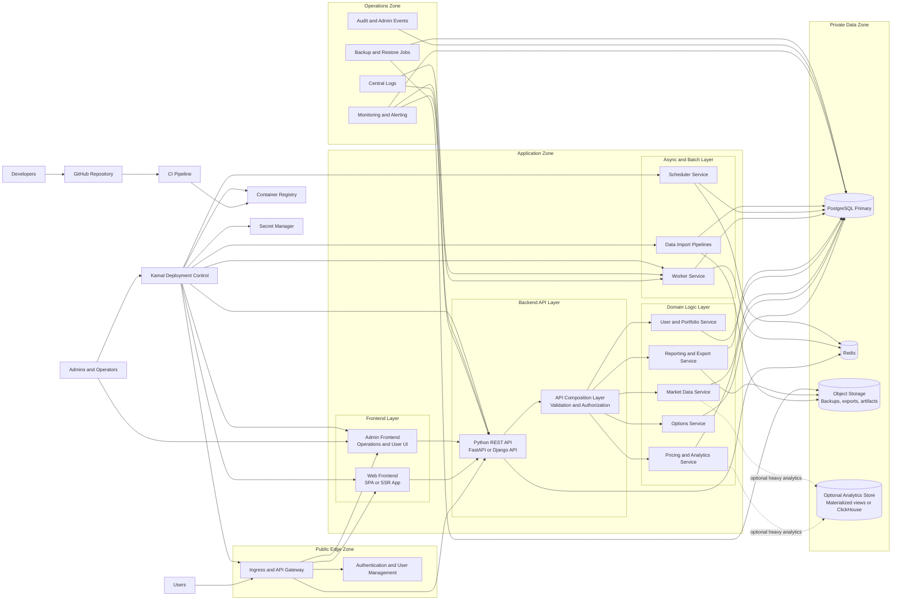

# Target Architecture

This diagram describes a possible future-state architecture for Skuld with stronger encapsulation of business logic, a clean API boundary, explicit deployment control, and fewer implicit operational side effects.

## Component Responsibilities

- `Ingress and API Gateway` is the single public entry point. It terminates TLS, routes traffic to frontend and API workloads, and provides a stable external contract for clients.
- `Authentication and User Management` owns login, session handling, identity, roles, and authorization policies. It should not be mixed into application page logic.
- `Web Frontend` is the user-facing product UI. Its responsibility is presentation, user interaction, and orchestration of API calls, not business calculations.
- `Admin Frontend` is a separate operational surface for support, user administration, job control, and controlled maintenance actions.
- `Python REST API` exposes stable application endpoints for frontend clients and external integrations. It should own request handling, API contracts, validation, and response mapping.
- `API Composition Layer` centralizes authorization, input validation, DTO mapping, and orchestration across multiple domain services so that controllers stay thin.
- `Options Service` owns option selection, spread construction, and option-domain workflows.
- `Pricing and Analytics Service` owns pricing logic, expected value calculations, Greeks-related computations, and other analytical workflows.
- `Market Data Service` owns ingestion, normalization, historization, and serving of external market data.
- `User and Portfolio Service` owns user-specific state such as watchlists, saved configurations, portfolios, and permissions scoped to a tenant or user.
- `Reporting and Export Service` owns generation of reports, downloadable exports, snapshots, and user-facing analytical outputs.
- `Worker Service` executes asynchronous tasks outside the request cycle, such as recalculations, data preparation, notifications, and report generation.
- `Scheduler Service` triggers periodic jobs in a controlled way and replaces hidden cron behavior embedded in application containers.
- `Data Import Pipelines` are isolated ingestion processes for external providers and bulk data refreshes. They should be restartable and observable independently of the web application.
- `PostgreSQL Primary` remains the transactional system of record for application state and operational data.
- `Redis` is the coordination layer for queues, caching, locks, and short-lived task state.
- `Object Storage` keeps artifacts that should not live in the database, such as exports, backups, uploaded files, and generated reports.
- `Optional Analytics Store` exists to offload heavy analytical reads from the transactional database once data volume or query complexity grows too much.
- `Monitoring and Alerting` owns runtime health visibility, SLO-style checks, incident signals, and infrastructure telemetry.
- `Central Logs` aggregates structured logs from all services so debugging and auditing are not tied to individual hosts.
- `Audit and Admin Events` records security-relevant and operator-driven actions in a dedicated, reviewable trail.
- `Backup and Restore Jobs` become explicit operational components rather than hidden scripts or one-off workflows.
- `Kamal Deployment Control` owns explicit target selection, rollout sequencing, release promotion, and rollback, instead of hiding deployment logic across many ad hoc workflows.
- `Secret Manager` owns runtime secrets, deploy-time secrets, rotation, and environment scoping. Application repositories should only reference secrets, not carry them.

## Main Changes Required From The Current App

- The current Streamlit-centric frontend would need to be split from business logic and replaced or wrapped by a dedicated frontend application with a stable API contract.
- Python page modules and UI-bound workflows would need to move behind REST endpoints so that frontend rendering and backend execution are clearly separated.
- Domain logic currently spread across pages, scripts, SQL files, and deploy-time behavior would need to be reorganized into explicit service boundaries.
- Long-running jobs and data collection flows should be moved out of the main application runtime into worker and scheduler processes with queue-based coordination.
- Implicit operational behavior in GitHub Actions, shell scripts, and remote commands should be replaced by explicit ops services and narrowly scoped deployment pipelines.
- The production database lifecycle should be managed as its own infrastructure concern instead of being partly coupled to app deployment behavior.
- Authentication and user management should move from container-local configuration toward a dedicated auth architecture with roles, session policies, and clearer ownership.
- Reporting, exports, restores, and maintenance commands should become explicit admin capabilities instead of living as scattered scripts and workflows.
- Environment configuration and secrets should be externalized so that deployment targets differ by environment metadata, not by hidden file mutations.
- Heavy analytics should gradually be decoupled from the main transactional path, either through materialized views, precomputed tables, or a dedicated analytics store.

## Architectural Intent

- The frontend should focus on user experience, not calculations.
- The API should expose stable capabilities, not UI-specific internals.
- Domain services should own business rules, not deployment scripts or page handlers.
- Background processing should be observable, retryable, and isolated.
- Infrastructure operations should be explicit, reviewable, and reversible.
- Deployment should answer one question clearly: which version goes to which target.