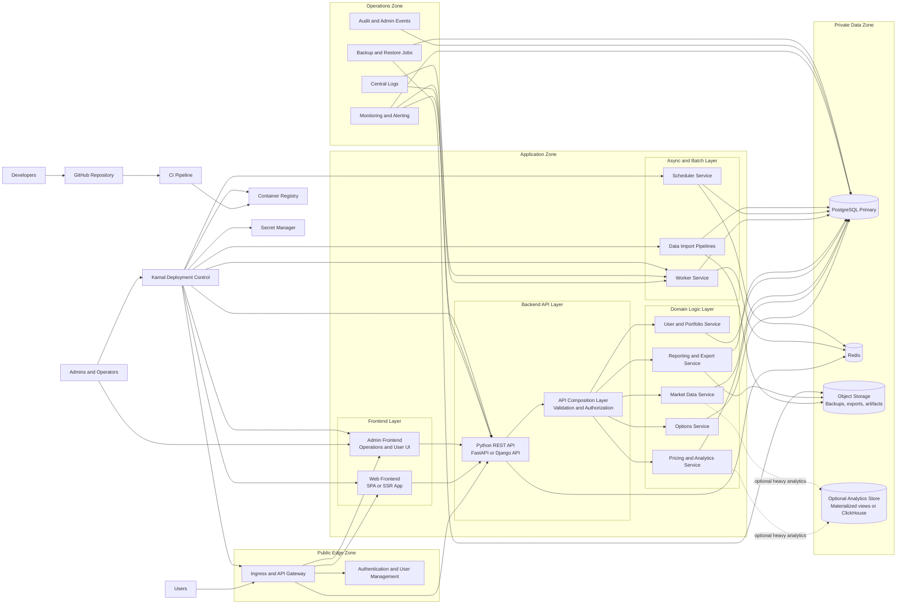

# Target Architecture

Dieses Diagramm beschreibt eine moegliche Zielarchitektur fuer Skuld mit staerkerer Logikkapselung, sauberem API-Schnitt, klar getrennten Deployments und weniger impliziter Betriebslogik.

## Notes

- Das Frontend wird zu einer eigenstaendigen Web-Anwendung statt direkt an fachlicher Python-UI-Logik zu haengen.
- Das Python-Backend wird als REST-API mit klaren Endpunkten, Auth, Validierung und Rollenmodell gekapselt.
- Fachlogik wird in eigene Services oder Module getrennt, statt in Seiten, Skripten und Deploy-Flows verteilt zu sein.
- Batch- und Import-Logik wird in Worker- und Scheduler-Prozesse verschoben und nicht mehr implizit ueber das Web-Frontend ausgelost.
- Deployment wird zentral ueber Kamal oder ein aehnlich explizites Target-Modell gesteuert, statt ueber viele versteckte Sonder-Workflows.
- Secrets und Laufzeitkonfiguration werden aus dem Repo herausgezogen und zentral verwaltet.
- Backups, Restore, Reporting und Export laufen ueber klar benannte Ops-Komponenten statt ueber ad-hoc Skripte im App-Stack.
- Fuer Userverwaltung ist ein eigener Auth-Baustein vorgesehen, entweder ueber einen externen IdP oder einen dedizierten Auth-Service.
- Schwere Analytics-Operationen koennen spaeter von der transaktionalen Hauptdatenbank getrennt werden.
- Die Zielarchitektur reduziert implizite Kopier- und Deploy-Pfade und macht klar, welche Komponente welche Verantwortung traegt.